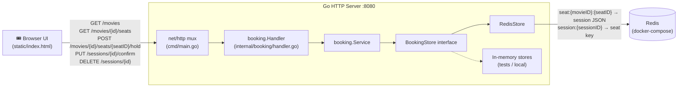
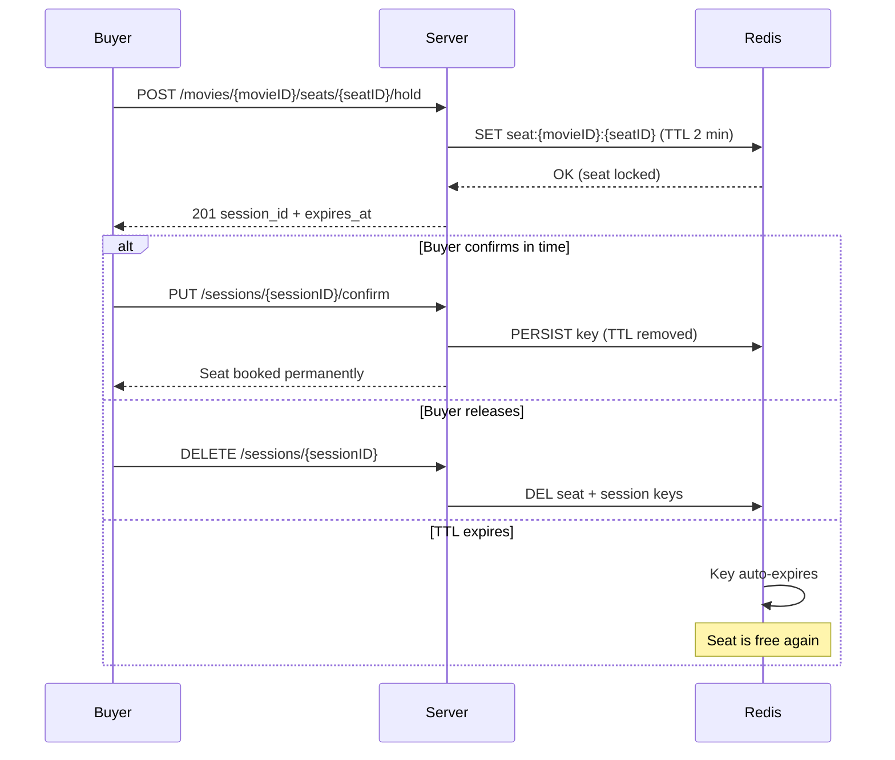

# SeatLock
## SeatLock is a cinema booking system written in Go that allows multiple buyers to book tickets concurrently. 
## Architecture



## Seat lifecycle


## Install & run
## Problem


Requires Go 1.24+ and Docker.

```bash
git clone https://github.com/tablecrasher/cinema-booking-system.git
cd cinema-booking-system

docker-compose up -d   # starts Redis
go run ./cmd            # starts the server

open http://localhost:8080
```
